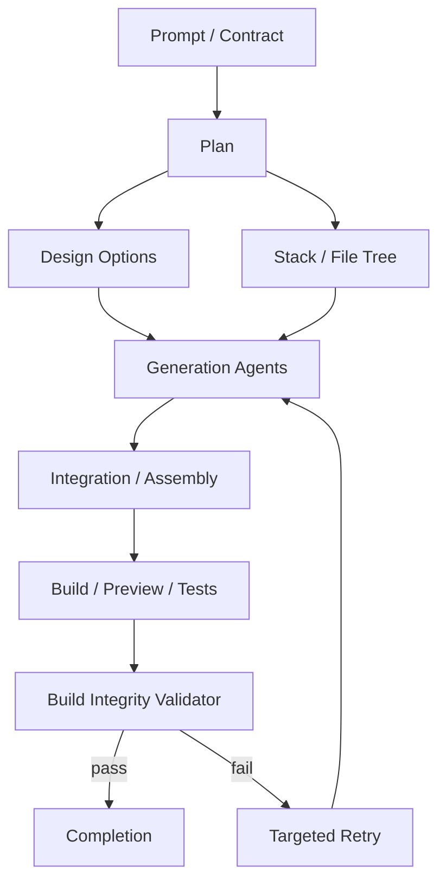

# Build Capability Audit

This document answers the audit framework against the current repository. The
standard is strict:

> If a capability cannot be proven with a concrete artifact, it is not treated
> as complete.

## Current Verdict

CrucibAI now has a hard Build Integrity Validator (BIV) in
`backend/orchestration/build_integrity_validator.py`. It is wired into final job
completion in `backend/orchestration/auto_runner.py`, after preview servability
and before completion. A build cannot be marked complete if BIV fails.

Public marketing copy was also corrected so mobile/App Store/test-count claims
do not outrun proof.

## 1. Claim-To-Capability Validation

| Claim | System | Proof artifact | Pipeline step | Failure behavior | Example output |
|---|---|---|---|---|---|
| Describe -> build | `generation_contract.py`, `planner.py`, `dag_engine.py`, `auto_runner.py` | run manifest, workspace files, proof bundle | plan, execute, verify | job failed with event/blueprint | generated workspace with `package.json`, `src/`, `dist/index.html` |
| Plan before build | `planner.py`, `plan_context.py`, BIV plan validator | plan object/markdown | planning | retry `planning`/`requirements` | plan must include pages, components, deps, file tree, risks |
| Agent DAG | `backend/agent_dag.py`, `agent_selection_logic.py`, `dag_engine.py` | `META/run_manifest.json` in generated jobs | DAG construction/execution | scheduler deadlock or step failure | ordered step list with agent names/status |
| Design-to-code | `design_agent.py`, `manus_parity_template.py`, BIV design checks | `ideas.md`, CSS tokens, components | design/system generation | BIV fails weak design tokens | `ideas.md` with 3 options, CSS with tokens |
| Preview/build proof | `preview_gate.py`, `browser_preview_verify.py`, `routes/preview_serve.py` | preview proof, screenshot, `dist/index.html` | verification.preview/final preview | fail `preview_gate`/`preview_not_servable` | `final_preview_ready` job event |
| Quality score | `truth_scores.py`, BIV score | quality score fields, BIV result | final enforcement | retry/fail if score < 85 | `{score: 92, recommendation: "approved"}` |
| Security scan | `verification_security.py`, `production_gate.py`, `elite_builder_gate.py` | verification proof/issues | verification.security/deploy | fail or strict block | secret pattern issue without secret echo |
| Export/download | backend workspace/file routes and code ZIP endpoints | ZIP response and manifest | delivery/download | return error if workspace missing | `crucibai-job-*-code.zip` |

## 2. Describe -> Plan -> Build -> Ship

1. Natural language is parsed by `parse_generation_contract()` in
   `backend/orchestration/generation_contract.py`.
2. It extracts stack groups: frontend frameworks/languages, backend frameworks,
   data stores, queues, auth, payments, notifications, realtime, deployment,
   testing, APIs, and docs.
3. It converts the prompt into a generation contract:

```json
{
  "product_name": "Generated System",
  "requested_groups": {
    "frontend_frameworks": ["react"],
    "testing": ["playwright"],
    "deployment": ["docker"]
  },
  "recommended_build_target": "full_system_generator",
  "directory_profile": "full_system_generator"
}
```

4. The plan is validated by `validate_plan_integrity()`.
5. Ambiguity should be handled by `clarification_agent.py`; if unresolved, the
   plan must declare assumptions and risks.
6. Missing plan fields cause a BIV plan failure and route retry to planning or
   requirements agents.

## 3. Plan-First System

Required plan fields are enforced by BIV:

- pages/routes/screens
- components/layout
- data/models/APIs/automations
- dependencies
- file tree
- risks/assumptions
- for UI builds: 3 design options and one chosen direction

If the user rejects the plan, the next plan version must supersede the previous
plan rather than patching code blindly. Plan diffs should be represented by
storing old/new plan artifacts and computing changed pages, dependencies, risks,
and acceptance criteria. This is partially present via plan artifacts; explicit
plan versioning is still a gap.

## 4. Design Intelligence

Current proof:

- `backend/agents/design_agent.py`
- `backend/orchestration/manus_parity_template.py`
- generated `ideas.md`
- generated CSS tokens and UI components
- BIV design checks for design artifact, tokens, typography, variants

Design options come from prompt analysis, domain heuristics, and templates. For
SaaS/product UI, Manus-parity generation now requires a named visual direction,
colors, typography, spacing, charts/sidebar tokens, and component variants.

Example design system proof:

```css
:root {
  --primary: #4f46e5;
  --background: #f8fafc;
  --foreground: #111827;
  --chart-1: #4f46e5;
  --sidebar: #ffffff;
  --radius: 8px;
}
```

## 5. Agent Swarm And DAG

Concrete agent files exist under `backend/agents/`:

- clarification
- code analysis
- code repair
- database
- database architect
- deployment
- design
- documentation
- image generator
- legal compliance
- preview validator
- stack selector
- video generator
- workspace explorer

The broad DAG/selection layer is in:

- `backend/agent_dag.py`
- `backend/orchestration/agent_selection_logic.py`
- `backend/orchestration/dag_engine.py`
- `backend/orchestration/swarm_agent_runner.py`

The exact public claim must not say "241 agents" unless `backend/agent_dag.py`
can enumerate that number at runtime and the UI shows the list. BIV does not
validate a marketing count; it validates final artifacts.

DAG structure required by policy:



The critical final assembly node is the integration/convergence phase plus BIV.

## 6. Convergence Engine

Fragments become a runnable app through:

- workspace writing/execution in `executor.py`
- assembly helpers in `workspace_assembly.py`
- preview gate in `preview_gate.py`
- final preview servability in `auto_runner.py`
- BIV convergence/orphan check in `build_integrity_validator.py`

BIV checks:

- entry point exists
- app/root exists
- router exists for web UI
- required pages are mounted
- important generated pages/features are referenced
- placeholder/scaffold language is blocked

## 7. Multi-Platform

| Track | Current status | Proof |
|---|---|---|
| Web | Active primary target | Vite/React generation, preview gate, BIV web/SaaS checks |
| Backend/API | Active sketch/target | `api_backend` build target, FastAPI/route checks |
| Automation | Active workflow/action runtime, now BIV-gated | `backend/automation/executor.py`, `run_agent` action, BIV automation tests |
| Mobile | Active gated Expo track; store submission still separate | `mobile_expo` build target, `expo-mobile/` artifacts, BIV mobile checks; App Store/Google Play submission requires credentials/EAS/store proof |

Public copy now reflects this: mobile builds produce validator-gated Expo/React
Native artifacts. App Store/Google Play submission is not marketed as automatic
because signing credentials, EAS cloud build, and store metadata must be proven
per customer/project.

## 8. run_agent Bridge

`run_agent` is implemented as an automation action in
`backend/automation/executor.py`.

Inputs:

- `agent_name` or `agent`
- `prompt`
- step output substitutions like `{{steps.0.output}}`

Execution:

- uses an injected callback when available
- otherwise calls `/api/agents/run-internal` with `X-Internal-Token`

Outputs:

- action result object from the agent
- log lines including `[RUN_AGENT]`

Recursion-loop prevention is not fully proven. BIV can validate that automation
artifacts exist, but explicit recursion depth/loop guards should be added before
claiming this as complete for arbitrary nested automation builds.

## 9. Import System

ZIP/Git/paste import must prove:

- archive parsing
- framework detection
- entry point detection
- dependency detection
- validation/repair path

Relevant code exists in workspace/file and git integration modules, but the
universal import validator is incomplete. BIV can validate a reconstructed
workspace after import; a dedicated import doctor remains a gap.

## 10. Quality Score System

Current formula in BIV:

- Architecture: 20
- Design System: 15
- Completeness: 20
- Runtime Validity: 25
- Integration: 10
- Deployability: 10

Thresholds:

- score >= 85 and no issues: approved
- score < 85: retry/fail
- score < 70 or blocker issue: hard fail

This is implemented in `build_integrity_validator.py` and tested in
`backend/tests/test_build_integrity_validator.py`.

## 11. Self-Healing

Existing repair systems:

- `repair_loop.py`
- `npm_build_autofix.py`
- `llm_code_repair.py`
- `code_repair_agent.py`
- `auto_runner.py` retry behavior

Failure is detected by verifier/BIV/preview/security gates. Retry routing now
appears in BIV results as `retry_targets`, e.g. `["frontend", "integration"]`.
Auto-runner currently fails with those targets recorded; automatic targeted
retry from BIV result is the next integration gap.

## 12. Transparency

Generated/user-visible artifacts:

- job events from `runtime_state.py` / event bus
- AgentMonitor UI in `frontend/src/pages/AgentMonitor.jsx`
- workspace file manifests
- proof bundles
- BIV result event: `build_integrity_validator_result`

Example BIV event:

```json
{
  "score": 92,
  "profile": "saas_ui",
  "phase": "final",
  "recommendation": "approved",
  "retry_targets": [],
  "issues": []
}
```

Token usage appears in agent monitor/status surfaces, but complete provider-cost
accounting per sub-agent is not fully proven here.

## 13. Security

Security checks include:

- secret pattern scan in `production_gate.py`
- security workspace verifier in `verification_security.py`
- elite gate checks in `elite_builder_gate.py`
- tenancy/RLS/RBAC/Stripe replay verifiers where relevant

Secrets are detected by high-confidence regexes without echoing the secret
value. CORS/auth validation is present in route/security verifiers but should be
expanded into a standalone security doctor before marketing as comprehensive.

## 14. Accessibility

Accessibility is not yet complete enough to claim "accessibility check on every
project." The public page was corrected. Required future proof:

- WCAG target (2.2 AA)
- automated checks such as axe/Playwright
- color contrast checks
- keyboard navigation checks
- alt/label/form checks
- repair loop for failed a11y issues

BIV can host these checks, but they are not fully implemented today.

## 15. Deployment

Deployment systems:

- `deterministic_deploy.py`
- `routes/deploy.py`
- `deployment_agent.py`
- Dockerfile and Railway build path

Current guarantee: deployable artifacts and guidance can be generated and gated.
"One click deploy" should only be shown when the specific provider integration
is configured and verified.

## 16. Mobile Deployment

Current status: active gated Expo track. The pipeline can generate a standalone
`expo-mobile/` project with:

- `package.json` scripts for Expo start/check/build guidance
- `app.json` Expo metadata
- `eas.json` build profiles
- `App.tsx` entry point
- screen files under `expo-mobile/src/screens/`
- README guidance for local run, EAS build, and store submission

BIV validates Expo/React Native app entry, mobile screens, metadata, EAS config,
and scripts before a mobile-targeted build can complete. Missing before claiming
full one-click mobile store deployment:

- user-owned Apple/Google developer credentials
- signing/certificate automation
- live EAS cloud build execution in the pipeline
- App Store/Google Play metadata validation
- TestFlight/internal testing proof

## 17. Testing System

Tests exist across backend and frontend. Verified during this implementation:

- `npm test -- --watchAll=false --runInBand NavAndPagesClickThrough.test.jsx`
  passed 10/10.
- `npm run build` passed for frontend.
- `pytest backend/tests/test_build_integrity_validator.py -q` passed 6/6.

The public "188 tests passing" claim was removed because the exact number must
come from a current CI run, not old marketing copy.

## 18. Decision Engine

Framework/design/dependency decisions are made through:

- `generation_contract.py` for stack extraction
- `build_targets.py` for target selection
- `agent_selection_logic.py` for agent expansion
- design artifacts and BIV for UI decisions

If a decision lacks a recorded artifact, it is considered an assumption.

## 19. Universality Test

What stays constant:

- parse prompt into contract
- plan first
- generate artifacts
- integrate into a runnable workspace
- verify with profile-specific gates
- fail/retry instead of shipping fragments

What changes:

- SaaS UI: pages, design system, charts, visual completeness
- e-commerce: catalog/cart/checkout/payment proof
- mobile: Expo/native entry, metadata, packaging
- automation: trigger, workflow, action runtime, run_agent bridge
- backend/API: routes, schema, auth, tests, security

BIV implements profile-specific validation for SaaS UI, web, mobile,
automation, API/backend, and universal fallback.

## 20. Final Output Guarantee

Every completed build must expose:

- final folder structure
- entry point
- run command
- build command
- deployment path/guidance
- proof bundle
- validator score

The new hard rule:

> A build is complete only if preview servability, enforcement, and Build
> Integrity Validator all pass.

## Final Meta Test

Question: "Show me exactly how you guarantee that this system always produces a
runnable, deployable product."

Honest answer: no software system can truthfully guarantee "always" for every
possible prompt, dependency outage, provider failure, invalid imported code, or
unknown platform requirement. The correct guarantee is narrower and stronger:

> CrucibAI must not mark a build complete unless concrete artifacts pass the
> required gates for that build profile.

That guarantee is now implemented by final preview servability plus BIV. If the
artifact cannot be proven runnable/deployable for the requested profile, the job
must fail with issues and retry targets instead of returning a fragment as a
completed product.
